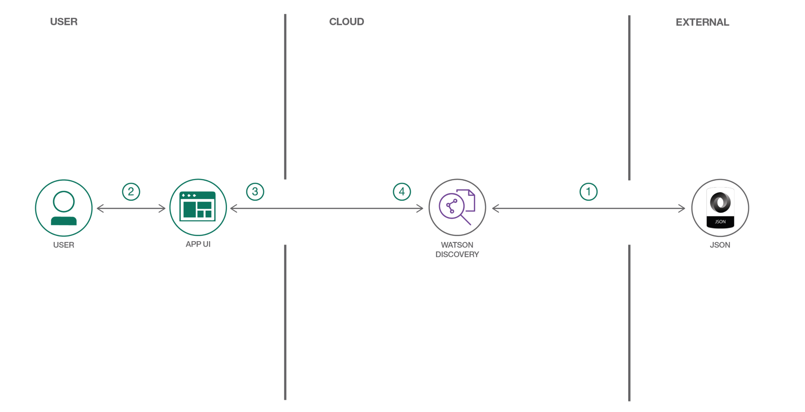
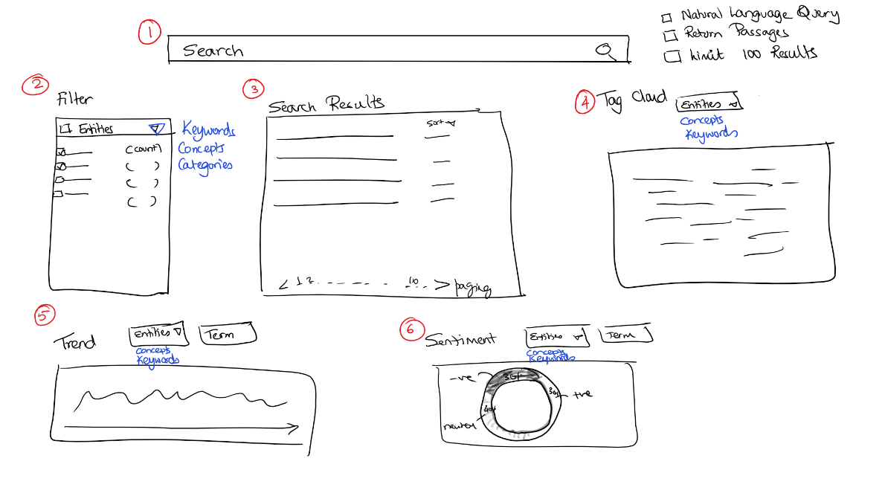
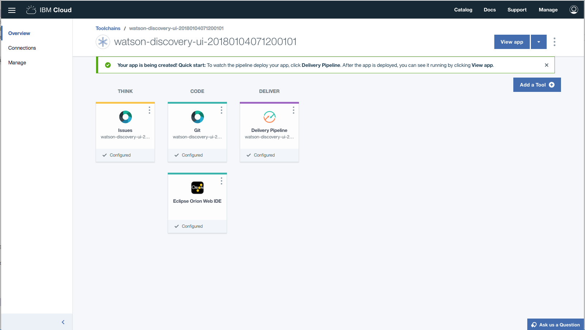
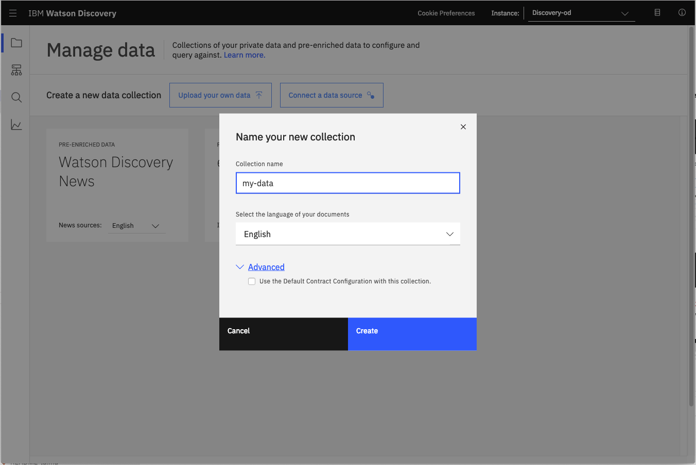
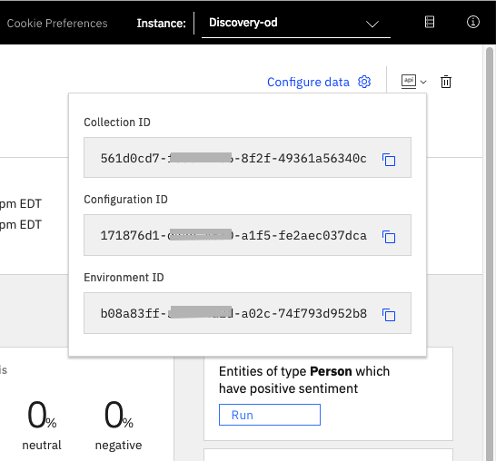
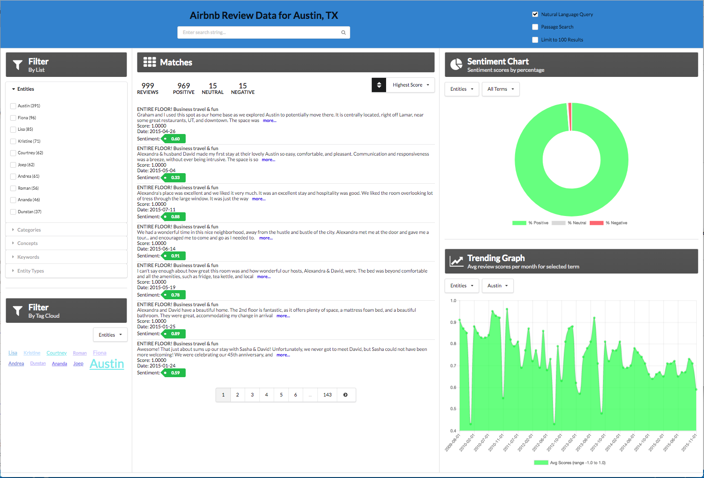
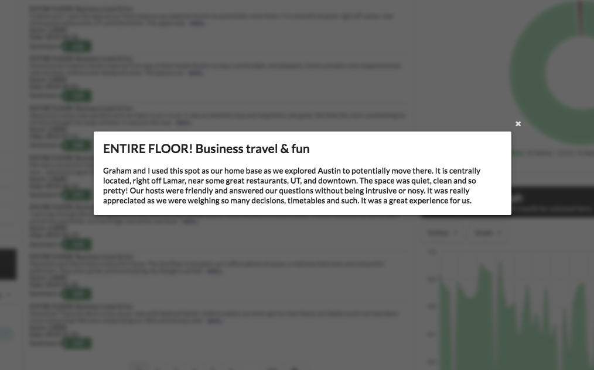
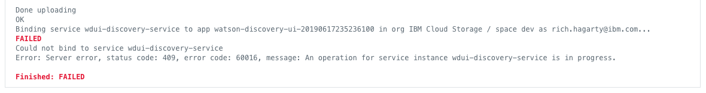

*Read this in other languages: [日本](README-ja.md).*

[](https://travis-ci.org/IBM/watson-discovery-ui)

# Develop a fully featured web app built on the Watson Discovery Service

In this code pattern, we walk you through a working example of a web application that queries and manipulates data from the Watson Discovery Service. This web app contains multiple UI components that you can use as a starting point for developing your own Watson Discovery Service applications. 

The main benefit of using the Watson Discovery Service is its powerful analytics engine that provides cognitive enrichments and insights into your data. This app provides examples of how to showcase these enrichments through the use of filters, lists and graphs. The key enrichments that we will focus on are:

* Entities - people, companies, organizations, cities, and more.
* Categories - classification of the data into a hierarchy of categories up to 5 levels deep.
* Concepts - identified general concepts that aren't necessarily referenced in the data.
* Keywords - important topics typically used to index or search the data.
* Sentiment - the overall positive or negative sentiment of each document.

For this code pattern, we will be using data that contains reviews of Airbnb properties located in the Austin, TX area. 

When the reader has completed this code pattern, they will understand how to:

* Load and enrich data in the Watson Discovery Service.
* Query and manipulate data in the Watson Discovery Service.
* Create UI components to represent enriched data created by the Watson Discovery Service.
* Build a complete web app that utilizes popular JavaScript technologies to feature Watson Discovery Service data and enrichments.



## Flow

1. The Airbnb review json files are added to the Discovery collection.
1. The user interacts with the backend server via the app UI. The frontend app UI uses React to render search results and can reuse all of the views that are used by the backend for server side rendering. The frontend is using semantic-ui-react components and is responsive.
1. User input is processed and routed to the backend server, which is responsible for server side rendering of the views to be displayed on the browser. The backend server is written using express and uses express-react-views engine to render views written using React.
1. The backend server sends user requests to the Watson Discovery Service. It acts as a proxy server, forwarding queries from the frontend to the Watson Discovery Service API while keeping sensitive API keys concealed from the user.

## UI controls and associated actions

Here is a rough sketch of the main UI screen, followed by a description of each UI component and their assoicated actions:



1. Search field and search parameters: Return results based on search criteria. Search parameters will effect how the user will enter values, how they will be displayed, and limit the number of matches.
1. List Filters: Multiple drop-down lists of filters that are applied to the search resullts. Each drop down list contains entities, categories, concepts and keywords associated with the results. For each drop down filter item, the number of matches will also be displayed. If a user selects a filter item, a new search will be conducted and will update the results panel (#3). Filter items selected will also effect what is shown in the tag cloud (#4).
1. Search results and pagination menu: Shows a page of result items (e.g. 5 per page) and a pagination menu to allow the user to scroll through pages of result items. There will also be a drop-down menu that will allow the user to sort the entries based on date, score, and sentiment value.
1. Tag cloud filter: Similar to the list filters (#2) but in a different format. One set of filter items (either entities, categories, concepts or keywords) can be displayed at one time. User can select/deselect items in the cloud to turn on/off filters. Applied filters in both filter views (#2 and #4) will always be in sync.
1. Trend chart: Chart to show the sentiment trend for a specific entity, category, concept, or keyword over time. The data will reflect the current matching result set.
1. Sentiment chart: Donut chart that shows the total percentages of postive, neutral and negative reviews of selected entities, categories, concepts, or keywords. The data will reflect the current matching result set.

> Note: see [DEVELOPING.md](DEVELOPING.md) for project structure.

## Watson Discovery Continuous Relevancy Training

This feature provides the ability of the Discovery service to learn from user behavior. By clicking on the "read more" button attached to each review, the user can inform Discovery that a particular review is more relevant than other non-clicked reviews. Discovery can than use that information to improve the ranking of results for future queries.

For more information about this feature, read about it [here](https://cloud.ibm.com/docs/services/discovery/continuous-training.html#crt).

> NOTE: This feature is only available with the "advanced" Watson Discovery service plan. This code pattern assumes the "lite" or "free" plan, so this feature is not enabled by default. For those users with the ability to create a paid Discovery plan, please link to the [`advanced-disco-plan`](https://github.com/IBM/watson-discovery-ui/tree/advanced-disco-plan) branch associated with this repo. The instructions and the `Deploy to IBM Cloud` button on that branch will initiate the creation of an "advanced" Discovery service.

## Included components

* [Watson Discovery](https://www.ibm.com/watson/services/discovery/): A cognitive search and content analytics engine for applications to identify patterns, trends, and actionable insights.

## Featured technologies

* [Node.js](https://nodejs.org/): An open-source JavaScript run-time environment for executing server-side JavaScript code.
* [React](https://reactjs.org/): A JavaScript library for building User Interfaces.
* [Express](https://expressjs.com) - A popular and minimalistic web framework for creating an API and Web server.
* [Semantic UI React](https://react.semantic-ui.com/): React integration of Semantic UI components. 
* [Chart.js](https://www.chartjs.org/): JavaScript charting package.
* [Jest](https://jestjs.io/): A JavaScript test framework.

# Watch the Video

[](https://youtu.be/5EEmQwcjUa4)

# Steps

Use the ``Deploy to IBM Cloud`` button **OR** create the services and run locally.

## Deploy to IBM Cloud

[](https://cloud.ibm.com/devops/setup/deploy?repository=https://github.com/IBM/watson-discovery-ui.git)

1. Press the above ``Deploy to IBM Cloud`` button and then click on ``Deploy``.

2. In Toolchains, click on Delivery Pipeline to watch while the app is deployed. Once deployed, the app can be viewed by clicking 'View app'.



3. To see the app and services created and configured for this journey, use the IBM Cloud dashboard. The app is named `watson-discovery-ui` with a unique suffix. The following services are created and easily identified by the `wdui-` prefix:
    * wdui-discovery-service

> NOTE: To save on memory when running in the IBM Cloud, only 300 of the available 1000 reviews will be loaded into the Watson Discovery service.

If errors occur, refer to the [Troubleshooting](#troubleshooting) section of this document.
## Run locally

> NOTE: These steps are only needed when running locally instead of using the ``Deploy to IBM Cloud`` button.

1. [Clone the repo](#1-clone-the-repo)
1. [Create IBM Cloud services](#2-create-ibm-cloud-services)
1. [Load the Discovery files](#3-load-the-discovery-files)
1. [Configure credentials](#4-configure-credentials)
1. [Run the application](#5-run-the-application)

### 1. Clone the repo

```bash
git clone https://github.com/IBM/watson-discovery-ui
```

### 2. Create IBM Cloud services

Create the following services:

* [**Watson Discovery**](https://cloud.ibm.com/catalog/services/discovery)

### 3. Load the Discovery files

Launch the **Watson Discovery** tool. Create a **new data collection**
by selecting the **Update your own data** option. Give the data collection a unique name.



When prompted to get started by **uploading your data**, select and upload the first 2 json documents located in your local `data/airbnb` directory. Once uploaded, you can then use the `Configure data` option to add the `Keyword Extraction` enrichment, as show here:


> Note: failure to do this will result in no `keywords` being shown in the app.

Once the enrichments are selected, use the `Apply changes to collection` button to upload the remaining json files found in `data/airbnb`. **Warning** - this make take several minutes to complete.

> There may be a limit to the number of files you can upload, based on your IBM Cloud account permissions.

### 4. Configure credentials

The credentials for you collection can be found by clicking the dropdown button located at the top right of the panel. Use these values to populate your `.env` file in the next step.

<p align="center">
  
</p>

```bash
cp env.sample .env
```

Edit the `.env` file with the necessary settings.

#### `env.sample:`

```bash
# Copy this file to .env and replace the credentials with
# your own before starting the app.

# Watson Discovery
DISCOVERY_URL=<add_discovery_url>
DISCOVERY_ENVIRONMENT_ID=<add_discovery_environment_id>
DISCOVERY_COLLECTION_ID=<add_discovery_collection_id>
## Un-comment and use either username+password or IAM apikey.
# DISCOVERY_IAM_APIKEY=<add_discovery_iam_apikey>
# DISCOVERY_USERNAME=<add_discovery_username>
# DISCOVERY_PASSWORD=<add_discovery_password>

# Run locally on a non-default port (default is 3000)
# PORT=3000
```

### 5. Run the application

1. Install [Node.js](https://nodejs.org/en/) runtime or NPM.
1. Start the app by running `npm install`, followed by `npm start`.
1. Access the UI by pointing your browser at `localhost:3000`.
> Note: server host can be changed as required in app.js and `PORT` can be set in `.env`.

# Sample UI layout



Note that each review will be truncated to 200 characters or less. A `more...` button will be provided for each review, and when clicked, the full review title and text will be displayed in a pop-up modal window, as shown below:



If the `more...` button is clicked, the review data will be passed back to Discovery so that it can be logged as a relevant review for the query. Refer to the [Watson Discovery Continuous Relevancy Training](#watson-discovery-continuous-relevancy-training) section above for more information on this feature.

# Troubleshooting

* Error: Environment {GUID} is still not active, retry once status is active

  > This is common during the first run. The app tries to start before the Discovery
environment is fully created. Allow a minute or two to pass. The environment should
be usable on restart. If you used `Deploy to IBM Cloud` the restart should be automatic.

* Error: Only one free environment is allowed per organization

  > To work with a free trial, a small free Discovery environment is created. If you already have a Discovery environment, this will fail. If you are not using Discovery, check for an old service thay you may want to delete. Otherwise use the .env DISCOVERY_ENVIRONMENT_ID to tell the app which environment you want it to use. A collection will be created in this environment using the default configuration.

* Error when loading files into Discovery

  > Loading all 2000 document files at one time into Discovery can sometimes lead to "busy" errors. If this occurs, start over and load a small number of files at a time.

* No keywords appear in the app

  > This can be due to not having a proper configuration file assigned to your data collection. See [Step 3](#3-load-the-discovery-files) above.

* When using the `Deploy to IBM Cloud` button, you get a failure during the `Deploy Stage`, as shown in this log message:

  

  > This can occur if the discovery service is not yet provisioned (you can check the resourse list in the `IBM Cloud` dashboard to verify). If so, wait until the service is marked as `Provisioned`, and then hit the `Redeploy` button at the top of the `Deply Stage` panel. After successfully deploying and connecting to the discovery service, check the logs of the running deployed app to check its progress as it loads the json files into the discovery collection.

# Links

* [Demo on Youtube](https://www.youtube.com/watch?v=5EEmQwcjUa4): Watch the video
* [Watson Node.js SDK](https://github.com/watson-developer-cloud/node-sdk): Download the Watson Node SDK.

# Learn more

* **Artificial Intelligence Code Patterns**: Enjoyed this Code Pattern? Check out our other [AI Code Patterns](https://developer.ibm.com/technologies/artificial-intelligence/)
* **AI and Data Code Pattern Playlist**: Bookmark our [playlist](https://www.youtube.com/playlist?list=PLzUbsvIyrNfknNewObx5N7uGZ5FKH0Fde) with all of our Code Pattern videos
* **With Watson**: Want to take your Watson app to the next level? Looking to utilize Watson Brand assets? [Join the With Watson program](https://www.ibm.com/watson/with-watson/) to leverage exclusive brand, marketing, and tech resources to amplify and accelerate your Watson embedded commercial solution.

# License

This code pattern is licensed under the Apache Software License, Version 2.  Separate third party code objects invoked within this code pattern are licensed by their respective providers pursuant to their own separate licenses. Contributions are subject to the [Developer Certificate of Origin, Version 1.1 (DCO)](https://developercertificate.org/) and the [Apache Software License, Version 2](https://www.apache.org/licenses/LICENSE-2.0.txt).

[Apache Software License (ASL) FAQ](https://www.apache.org/foundation/license-faq.html#WhatDoesItMEAN)
