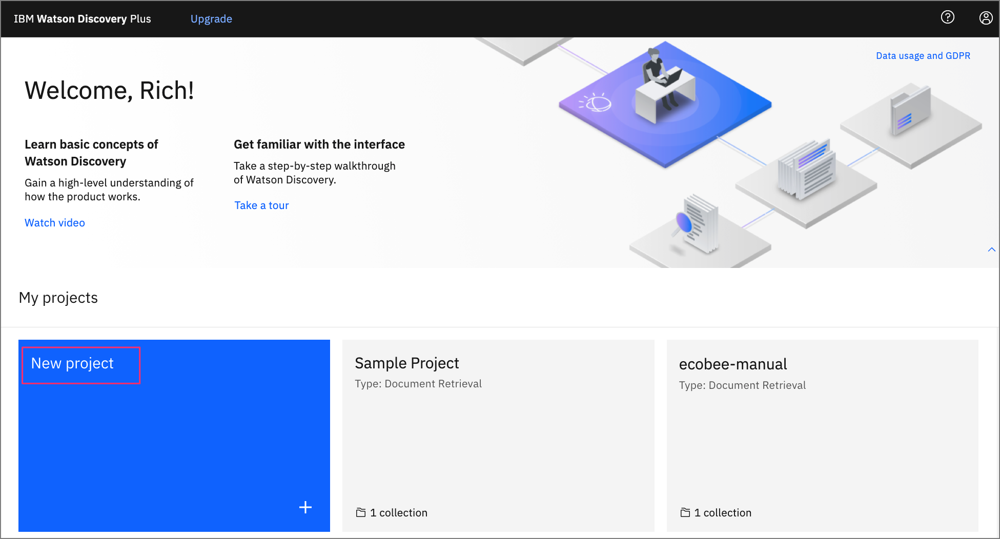

*Read this in other languages: [日本](README-ja.md).*

[](https://travis-ci.org/IBM/watson-discovery-ui)

# Develop a fully featured web app built on the Watson Discovery Service

>**Note:** This code pattern has been updated to work with Watson Discovery V2. Unfortunately, some of the original features of the V1 version are no longer supported and had to be removed - please keep this in mind as you view the source code, documentation and accompanying video.

In this code pattern, we walk you through a working example of a web application that queries and manipulates data from the Watson Discovery Service. This web app contains multiple UI components that you can use as a starting point for developing your own Watson Discovery Service applications. 

The main benefit of using the Watson Discovery Service is its powerful analytics engine that provides cognitive enrichments and insights into your data. This app provides examples of how to showcase these enrichments through the use of filters, lists and graphs. The key enrichments that we will focus on are:

* Entities - people, companies, organizations, cities, and more.
* Keywords - important topics typically used to index or search the data.
* Sentiment - the overall positive or negative sentiment of each document.
* Parts of Speech - recognizes parts of speech, including nouns, verbs, adjectives, adverbs, conjunctions, interjections, and numerals.

For this code pattern, we will be using data that contains reviews of Airbnb properties located in the Austin, TX area.

When the reader has completed this code pattern, they will understand how to:

* Load and enrich data in the Watson Discovery Service.
* Query and manipulate data in the Watson Discovery Service.
* Create UI components to represent enriched data created by the Watson Discovery Service.
* Build a complete web app that utilizes popular JavaScript technologies to feature Watson Discovery Service data and enrichments.


## Flow

1. The Airbnb review json files are added to the Discovery collection.
1. The user interacts with the backend server via the app UI. The frontend app UI uses React to render search results and can reuse all of the views that are used by the backend for server side rendering. The frontend is using semantic-ui-react components and is responsive.
1. User input is processed and routed to the backend server, which is responsible for server side rendering of the views to be displayed on the browser. The backend server is written using express and uses express-react-views engine to render views written using React.
1. The backend server sends user requests to the Watson Discovery Service. It acts as a proxy server, forwarding queries from the frontend to the Watson Discovery Service API while keeping sensitive API keys concealed from the user.

## UI controls and associated actions

Here is a rough sketch of the main UI screen, followed by a description of each UI component and their assoicated actions:


1. Search field and search parameters: Return results based on search criteria. Search parameters will effect how the user will enter values, how they will be displayed, and limit the number of matches.
1. List Filters: Multiple drop-down lists of filters that are applied to the search resullts. Each drop down list contains entities, categories, concepts and keywords associated with the results. For each drop down filter item, the number of matches will also be displayed. If a user selects a filter item, a new search will be conducted and will update the results panel (#3). Filter items selected will also effect what is shown in the tag cloud (#4).
1. Search results and pagination menu: Shows a page of result items (e.g. 5 per page) and a pagination menu to allow the user to scroll through pages of result items. There will also be a drop-down menu that will allow the user to sort the entries based on date, score, and sentiment value.
1. Tag cloud filter: Similar to the list filters (#2) but in a different format. One set of filter items (either entities, categories, concepts or keywords) can be displayed at one time. User can select/deselect items in the cloud to turn on/off filters. Applied filters in both filter views (#2 and #4) will always be in sync.
1. Trend chart: Chart to show the sentiment trend for a specific entity, category, concept, or keyword over time. The data will reflect the current matching result set. **[Removed with V2 update]**
1. Sentiment chart: Donut chart that shows the total percentages of postive, neutral and negative reviews of selected entities, categories, concepts, or keywords. The data will reflect the current matching result set. **[Removed with V2 update]**

> Note: see [DEVELOPING.md](DEVELOPING.md) for project structure.

## Included components

* [Watson Discovery](https://www.ibm.com/watson/services/discovery/): A cognitive search and content analytics engine for applications to identify patterns, trends, and actionable insights.

## Featured technologies

* [Node.js](https://nodejs.org/): An open-source JavaScript run-time environment for executing server-side JavaScript code.
* [React](https://reactjs.org/): A JavaScript library for building User Interfaces.
* [Express](https://expressjs.com) - A popular and minimalistic web framework for creating an API and Web server.
* [Semantic UI React](https://react.semantic-ui.com/): React integration of Semantic UI components. 
* [Chart.js](https://www.chartjs.org/): JavaScript charting package.
* [Jest](https://jestjs.io/): A JavaScript test framework.

# Watch the Video

[](https://youtu.be/5EEmQwcjUa4)

# Steps

1. [Clone the repo](#1-clone-the-repo)
1. [Create your Watson Discovery service](#2-create-your-watson-discovery-service)
1. [Create a new project](#3-create-a-new-project)
1. [Upload data files into collection](#4-upload-data-files-into-collection)
1. [Enrich the data](#5-enrich-the-data)
1. [Add Watson Discovery credentials](#6-add-watson-discovery-credentials)
1. [Run the application](#7-run-the-application)

## 1. Clone the repo

```bash
git clone https://github.com/IBM/watson-discovery-ui
```

## 2. Create your Watson Discovery service

To create your Watson Discovery service:

  1. Click `Create resource` on your IBM Cloud dashboard.

  2. Search the catalog for `discovery`.

  3. Click the `Discovery` tile to launch the create panel.


Enter a unique name, select a location, and select the default **Plus** plan.

>**NOTE**: The first instance of the Plus plan for IBM Watson Discovery comes with a free 30-day trial. If you no longer require your Plus instance for Watson Discovery after going through this exercise, you can delete it.


From the Discovery instance page, click `Launch Watson Discovery`.

## 3. Create a new project

The landing page for the Discovery service shows you a list of current projects. Click `New project`.



Give the project a unique name and select the `Document Retrieval` option, then click `Next`.


## 4. Upload data files into collection

The next step is telling Discovery where your data will come from. In this code pattern, we will be uploading the data from JSON data files, so click `Upload data`, and then click `Next`.


Enter a collection name, then click `Next`.


>**NOTE**: The Watson Discovery service queries are defaulted to be performed on all collections within a project. For this reason, it is advised that you create a new project to contain the collection we will be creating for this code pattern.

To load our AirBnB reviews, click on `Drag and drop files here or upload` button to select and upload the JSON review files located in your local `data/airbnb` directory.


When you complete the action, click `Finish`.

Be patient as the data files are uploaded. Discovery provides alerts to tell you when the upload is complete.

## 5. Enrich the data

Click `Manage collections` on the left to show all of the collections associated with your project.

>**Note**: To change which project you are currently working on, you can click `My projects` at the top of the page.


When you click the collection that you just created, you will see that all 999 reviews have been loaded.


Select the `Enrichments` tab. As you can see, the default enrichments are Part of speech and Entities v2. For this review data, you are also going to include Keywords and Sentiment of Document.


For each of these new enrichments, click `Fields to enrich`, and select the `text` field.

Click `Apply changes and reprocess` to add the enrichments.

## 6. Add Watson Discovery credentials

Next, you'll need to add the Watson Discovery credentials to the .env file.

1. From the home directory of your cloned local repo, create a .env file by copying it from the sample version.

    ```bash
    cp env.sample .env
    ```

2. Locate the service credentials listed on the home page of your Discovery service and copy the `API Key` and `URL` values.

    

3. You also need your project ID, which you can get from the Watson Discovery Integrate and deploy panel for your project.

    

4. Take the copied values and paste them into the `.env` file:

    ```bash
    # Copy this file to .env and replace the credentials with
    # your own before starting the app.

    # Watson Discovery
    DISCOVERY_PROJECT_ID=0a3f4e2d-bb5e-9999-8888-631535710b06
    DISCOVERY_APIKEY=hyZeFTi9g_zzzzzzzz-1TG6p0V2hEoVuaAG56
    DISCOVERY_URL=https://api.us-south.discovery.watson.cloud.ibm.com/instances/40b3d31e-9999-8888-fd24e28a1f7b

    # Run locally on a non-default port (default is 3000)
    # PORT=3000
    ```

## 7. Run the application

Install [Node.js](https://nodejs.org/en/) runtime or NPM.

Then run:

```bash
npm install
npm start
```

The application will be available in your browser at `http://localhost:3000`.

>**NOTE**: The server host can be changed as required in app.js and `PORT` can be set in the `.env` file.

# Sample UI layout


Note that each review will be truncated to 200 characters or less. A `more...` button will be provided for each review, and when clicked, the full review title and text will be displayed in a pop-up modal window, as shown below:


# Troubleshooting

* Error: Environment {GUID} is still not active, retry once status is active

  > This is common during the first run. The app tries to start before the Discovery
environment is fully created. Allow a minute or two to pass. The environment should
be usable on restart. If you used `Deploy to IBM Cloud` the restart should be automatic.

* Error: Only one free environment is allowed per organization

  > To work with a free trial, a small free Discovery environment is created. If you already have a Discovery environment, this will fail. If you are not using Discovery, check for an old service thay you may want to delete. Otherwise use the .env DISCOVERY_ENVIRONMENT_ID to tell the app which environment you want it to use. A collection will be created in this environment using the default configuration.

* Error when loading files into Discovery

  > Loading all 2000 document files at one time into Discovery can sometimes lead to "busy" errors. If this occurs, start over and load a small number of files at a time.

* No keywords appear in the app

  > This can be due to not having a enrichments enabled in your data collection. See [Step 5](#5-enrich-the-data) above.

* When using the `Deploy to IBM Cloud` button, you get a failure during the `Deploy Stage`, as shown in this log message:

  

  > This can occur if the discovery service is not yet provisioned (you can check the resourse list in the `IBM Cloud` dashboard to verify). If so, wait until the service is marked as `Provisioned`, and then hit the `Redeploy` button at the top of the `Deply Stage` panel. After successfully deploying and connecting to the discovery service, check the logs of the running deployed app to check its progress as it loads the json files into the discovery collection.

# Links

* [Demo on Youtube](https://www.youtube.com/watch?v=5EEmQwcjUa4): Watch the video
* [Watson Node.js SDK](https://github.com/watson-developer-cloud/node-sdk): Download the Watson Node SDK.

# Learn more

* **Artificial Intelligence Code Patterns**: Enjoyed this Code Pattern? Check out our other [AI Code Patterns](https://developer.ibm.com/technologies/artificial-intelligence/)
* **AI and Data Code Pattern Playlist**: Bookmark our [playlist](https://www.youtube.com/playlist?list=PLzUbsvIyrNfknNewObx5N7uGZ5FKH0Fde) with all of our Code Pattern videos
* **With Watson**: Want to take your Watson app to the next level? Looking to utilize Watson Brand assets? [Join the With Watson program](https://www.ibm.com/watson/with-watson/) to leverage exclusive brand, marketing, and tech resources to amplify and accelerate your Watson embedded commercial solution.

# License

This code pattern is licensed under the Apache Software License, Version 2.  Separate third party code objects invoked within this code pattern are licensed by their respective providers pursuant to their own separate licenses. Contributions are subject to the [Developer Certificate of Origin, Version 1.1 (DCO)](https://developercertificate.org/) and the [Apache Software License, Version 2](https://www.apache.org/licenses/LICENSE-2.0.txt).

[Apache Software License (ASL) FAQ](https://www.apache.org/foundation/license-faq.html#WhatDoesItMEAN)
