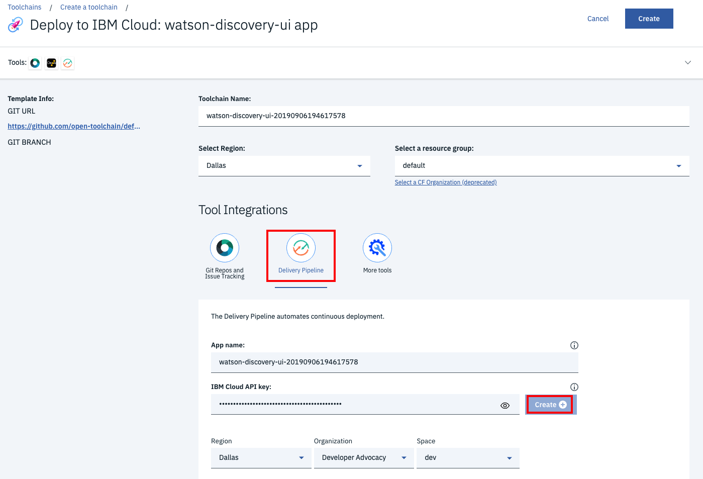

# Run on IBM Cloud with Cloud Foundry

This document shows how to run the `watson-discovery-ui` application using Cloud Foundry on IBM Cloud.

> **NOTE**: This app cannot be deployed to IBM Cloud with Cloud Foundry **if** you are using a free trial IBM Cloud account. This type of account is classified as a `Lite` accoount, and has a limit of 256 MB of instantaneous runtime memory available for your Cloud Foundry apps. The `watson-discovery-ui` app requires 512 MB.
>
> If you're using a Lite account, you can get more memory by upgrading to a billable account (limit is 2 GB). From the IBM Cloud console, go to **Manage** > **Account**, and select `Account settings`. For more information about Lite account features, see [Lite account](https://cloud.ibm.com/docs/account?topic=account-accounts#liteaccount).

## Steps

    

1. Click the **Deploy to IBM Cloud** button and click on the **Delivery Pipeline** tool.

2. Create an `IBM Cloud API key` by pressing the **Create** button located next to the API key field. Once generated, select the appropriate `Region`, `Organization` and `Space`, then click **Create** at the top of the panel to start the deployment process.

3. From the Toolchains view, click on the Delivery Pipeline to watch while the app is deployed. Here you'll be able to see logs about the deployment.

4. To see the app and services that were created use the [IBM Cloud dashboard](https://cloud.ibm.com). The app is named `watson-discovery-ui` with a unique suffix. The following services are created  and easily identified by the `wdui-` prefix:

    * wdui-discovery-service

> NOTE: To save on memory when running in the IBM Cloud, only 300 of the available 1000 reviews will be loaded into the Watson Discovery service. If you choose to manually add the additional reviews to your Discovery collection after the app has been deployed, you will need to stop and re-start the app to view them.

