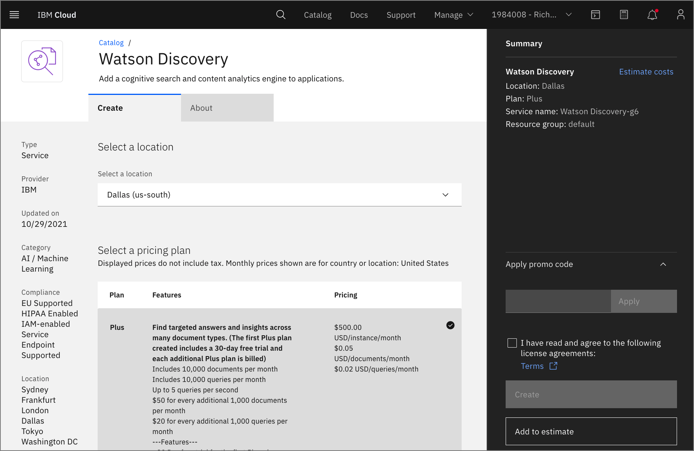
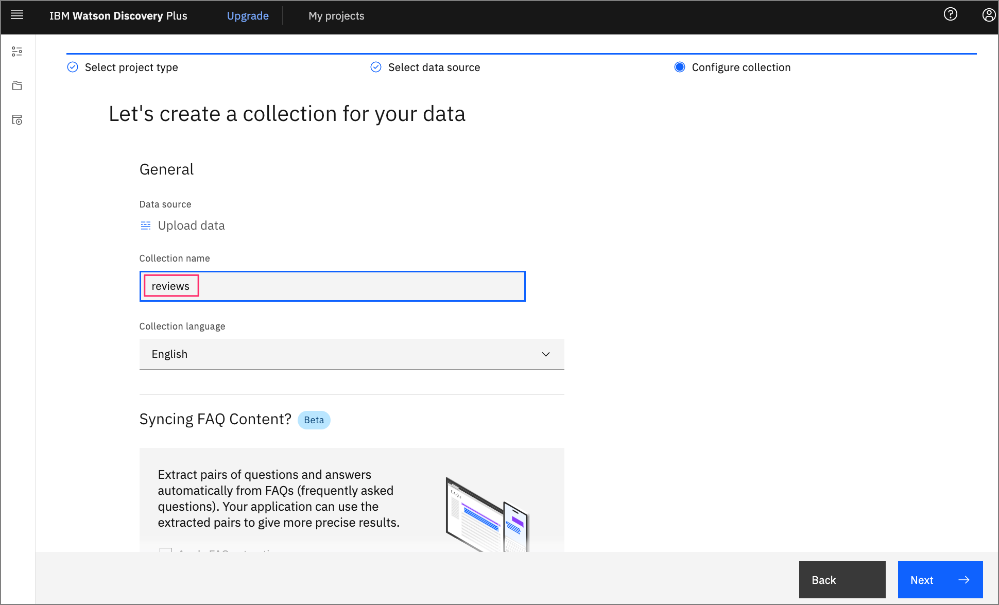
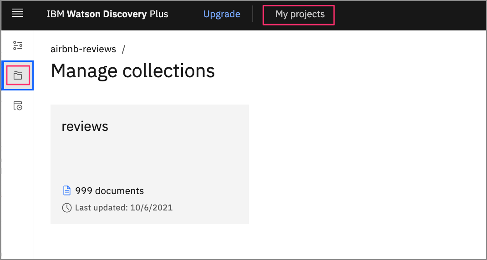
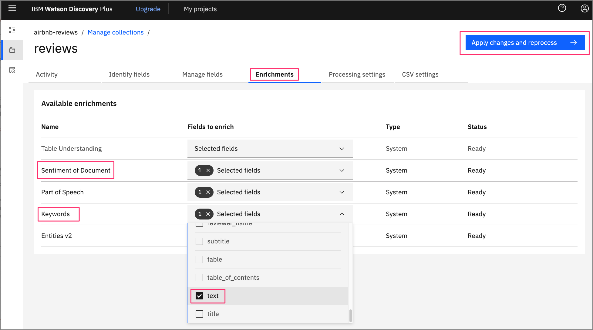

# Run locally

This document shows how to run the `watson-discovery-ui` application on your local machine.

## Steps

1. [Clone the repo](#1-clone-the-repo)
1. [Create your Watson Discovery service](#2-create-your-watson-discovery-service)
1. [Create a new project](#3-create-a-new-project)
1. [Upload data files into collection](#4-upload-data-files-into-collection)
1. [Enrich the data](#5-enrich-the-data)
1. [Add Watson Discovery credentials](#6-add-watson-discovery-credentials)
1. [Run the application](#7-run-the-application)

## 1. Clone the repo

```bash
git clone https://github.com/IBM/watson-discovery-ui
```

## 2. Create your Watson Discovery service

To create your Watson Discovery service:

  1. Click `Create resource` on your IBM Cloud dashboard.

  2. Search the catalog for `discovery`.

  3. Click the `Discovery` tile to launch the create panel.



Enter a unique name, select a location, and select the default **Plus** plan.

**NOTE**: The first instance of the Plus plan for IBM Watson Discovery comes with a free 30-day trial. If you no longer require your Plus instance for Watson Discovery after going through this exercise, you can delete it.


From the Discovery instance page, click `Launch Watson Discovery`.

## 3. Create a new project

The landing page for the Discovery service shows you a list of current projects. Click `New project`.


Give the project a unique name and select the `Document Retrieval` option, then click `Next`.


## 4. Upload data files into collection

The next step is telling Discovery where your data will come from. In this code pattern, we will be uploading the data from JSON data files, so click `Upload data`, and then click `Next`.


Enter a collection name, then click `Next`.



**NOTE**: The Watson Discovery service queries are defaulted to be performed on all collections within a project. For this reason, it is advised that you create a new project to contain the collection we will be creating for this code pattern.

To load our AirBnB reviews, click on `Drag and drop files here or upload` button to select and upload the JSON review files located in your local `data/airbnb` directory.


When you complete the action, click `Finish`.

Be patient as the data files are uploaded. Discovery provides alerts to tell you when the upload is complete.

## 5. Enrich the data

Click `Manage collections` on the left to show all of the collections associated with your project.

**Note**: To change which project you are currently working on, you can click `My projects` at the top of the page.



When you click the collection that you just created, you will see that all 999 reviews have been loaded.


Select the `Enrichments` tab. As you can see, the default enrichments are Part of speech and Entities v2. For this review data, you are also going to include Keywords and Sentiment of Document.



For each of these new enrichments, click `Fields to enrich`, and select the `text` field.

Click `Apply changes and reprocess` to add the enrichments.

## 6. Add Watson Discovery credentials

Next, you'll need to add the Watson Discovery credentials to the .env file.

1. From the home directory of your cloned local repo, create a .env file by copying it from the sample version.

    ```bash
    cp env.sample .env
    ```

2. Locate the service credentials listed on the home page of your Discovery service and copy the `API Key` and `URL` values.

    

3. You also need your project ID, which you can get from the Watson Discovery Integrate and deploy panel for your project.

    

4. Take the copied values and paste them into the `.env` file:

    ```bash
    # Copy this file to .env and replace the credentials with
    # your own before starting the app.

    # Watson Discovery
    DISCOVERY_PROJECT_ID=0a3f4e2d-bb5e-9999-8888-631535710b06
    DISCOVERY_APIKEY=hyZeFTi9g_zzzzzzzz-1TG6p0V2hEoVuaAG56
    DISCOVERY_URL=https://api.us-south.discovery.watson.cloud.ibm.com/instances/40b3d31e-9999-8888-fd24e28a1f7b

    # Run locally on a non-default port (default is 3000)
    # PORT=3000
    ```

## 7. Run the application

Install [Node.js](https://nodejs.org/en/) runtime or NPM.

Then run:

```bash
npm install
npm start
```

The application will be available in your browser at `http://localhost:3000`.

> Note: server host can be changed as required in app.js and `PORT` can be set in the `.env` file.

[](https://github.com/IBM/watson-discovery-ui#deployment-options)
